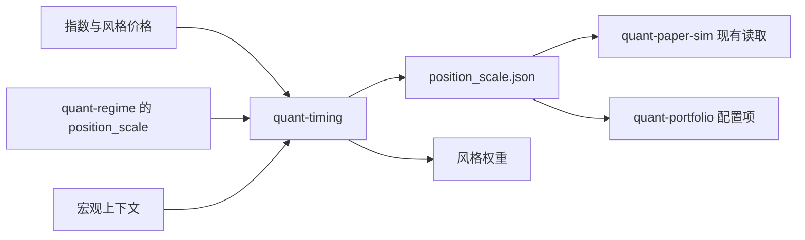

# quant-timing

统一实验对比通过`standard/metrics.json`的`backtest_stats`展示策略与基准的描述性全区间收益，并明确标注其不属于样本外验收指标。样本外结论继续使用测试折、`mean_excess_return`和`mean_matched_excess_return`；没有原始同口径指标的年化收益、Sharpe和回撤保持为空。`measurement_basis`记录实际区间和收益用途，不把全样本收益替换成独立前向证据。

指数与风格组合的研究层。它做两件事：

- 仓位择时：用已经走完的波动和窗口收益决定股票预算，其余放在现金。
- 风格择时：在大小盘、价值成长这两对风格之间做多头倾斜。

交易对象是指数和风格袖套，不是个股。规则写在配置里，验证段不搜索参数。样本外对照没有通过时，不会写出可供下游读取的 `position_scale.json`。

这不是价格预测，也不会下单。订单文件里的状态固定为 `target`。

## 时点

决策日收盘可以使用当天及更早的价格。这个权重赚的是下一根 K 线的收益，调仓成本也记在下一根 K 线上。信号不足时仓位是现金，不会外推成满仓。

完整约定和一笔三天的数字例子见 [研究契约](docs/RESEARCH_CONTRACT.md)。

## 运行

```powershell
python -m pip install -e ".[dev]"
python -m quant_timing.synthetic
python -m quant_timing run --config configs/combined.yaml --out outputs/demo
python -m pytest -q
python -m ruff check src tests
```

`configs/position_only.yaml` 只做仓位择时，股票预算全部留在市场袖套。

已有研究配置可以先做原生只读预检：

```powershell
python -m quant_timing preflight --config configs/combined.yaml
```

预检与`run`共用来源解析、读取与静态业务校验，检查主市场/风格列、所需信号、现金或期货列、
外部仓位和宏观输入，以及是否存在带后续收益日期的滚动窗口。输出JSON包含原配置、配置摘要、
实际读取文件的SHA-256与修改时间、观察区间和结构性折数。预检不生成信号、权重、模拟账本、
泄漏审计或可发布仓位，也不写文件；动态覆盖、有效计分与最新仓位发布仍在完整研究中判断。

来源可显式声明`source.evidence_kind`为`synthetic`、`retrospective`或`user_provided`；缺省为
`unspecified`，不根据旧`source.mode`或文件名猜测。来源声明不是市场认证。
相对路径保持原有配置目录/其父目录的解析顺序，预检和执行都固定到实际找到的同一文件。
`run`重新读取并核对输入，在读取或研究期间变化时拒绝发布；输出目录不得包含来源文件。
新的`run_context.json`随整套产物原子发布，记录本次输入身份，不改动既有标准CSV口径。

结构性预检通过不保证最新仓位能发布。历史不足或最新仍处于预热时，运行保留阻断原因与标准
研究产物，不导出`position_scale.json`；宏观策略要求`hold_previous`时同样不发布新仓位。
全样本曲线仍只作描述，滚动测试折与因果审计单独判断，不据此声称正超额收益。

`preflight`和`run`都接受可选`--overrides`文件，目前只允许`cost_multiplier`（0至10，默认1），
同时缩放原`costs.bps`和`costs.impact_coef`，不修改原文件、资本、模型或窗口。覆盖文件也记录
输入指纹。新产物把滚动折、其CSV哈希、因果审计、仓位发布决定和CLI输入上下文纳入已被
清单哈希保护的`standard/metrics.json`，供Studio在独立上游环境核验展示；旧产物不会补写。

## 输出

| 文件 | 用途 |
| --- | --- |
| `position_scale.json` | 最新总仓位。只有审计通过、并且至少有一折打出了收益时才写出。`quant-paper-sim` 现有读取逻辑只使用其中的 `position_scale`。 |
| `portfolio_overlay.yaml` | 把同一个系数抄到已有的 `quant-portfolio` 策略条目上。 |
| `style_weights.csv` | 每期的风格权重和现金。 |
| `position_history.csv` | 模型仓位、封顶后的仓位和特征。 |
| `decision.json` | 含 `use`、`hold_previous` 或 `blocked` 的完整决定。 |
| `validation/` | 走步折、泄漏审计和摘要。全样本收益只作描述。 |
| `standard/` | 与研究运行契约一致的收益、持仓、目标订单、成本和暴露。 |
| `attribution/daily.csv` | 策略和匹配敞口对照的逐日资产、现金、保证金、期货盈亏及两项模型成本；文件哈希绑定在标准metrics中。 |

持仓文件记录收盘调仓前的实际数量、金额和权重，`return_weight`用于上一笔决策的收益归因。期货和保证金使用各自的估值定义。所有产物验证成功后整体发布；导出失败不会提前发布仓位文件，非空输出目录拒绝覆盖。

新运行的`standard/metrics.json.return_attribution`给出描述性全区间与每个原生测试折的可加总贡献。
按每日的期初净资产连接贡献后，资产和现金收益、期货盈亏、基础成本及冲击成本的合计等于净收益。
每折独立以1为归因期初，沿用既有决策日筛选及次日收益，未另行建仓；重叠折不拼接、不增加独立样本。
匹配敞口贡献差属于账本分解，不单独证明仓位或风格的因果效应。详见[研究契约](docs/RESEARCH_CONTRACT.md)。

`standard/costs.csv.slippage`在新归因契约下仅记录配置bps对应的模型基础成本；非线性冲击单列到
`market_impact`，费用合计和原收益路径不变。这两项均不是独立成交参考价测得的真实滑点。
旧运行不补写、不重新解释其旧成本列；新版核验器仍可读取不含归因的旧标准产物。



下游接入时不改它们的接口。模拟配置继续指向一个含 `position_scale` 的 JSON。组合配置继续在策略条目上填写 `position_scale`。

仓位模型可以是原来的三档规则，也可以是波动率目标、时间序列动量或均线趋势。风格可以按动量、估值差、盈利修正或拥挤度倾斜，并限制相对等权的偏离。现金可以用收益率或债券价格的涨跌，股票预算也可以用股指期货调到目标 beta。单日调仓幅度和回撤线在决策前生效。冲击成本和固定费用一起扣在下一根 K 线上。

真实指数对照：

```powershell
python tools/fetch_public_indices.py --futures-only --offline
python -m quant_timing compare --config configs/market_comparison.yaml --out studies/market_comparison
```

账本修复后的十二组公开对照见[2026-10-01回归重放](studies/market_comparison/2026-10-01-regression/README.md)，原表保留为历史结果。所有模型统一从2019-03-08开始，使用同一份截至2026-09-28的既有快照；这次重放不是新增样本外证据。期货序列可由已提交的单合约收盘价和独立交易日历离线重建，上市前及数据覆盖前不会生成价格。公开成交量只用于行业相对权重，不推算人民币容量；容量及参与率保持空值。完整数据口径见`data/public/SOURCE.md`。这些固定参数下的研究结果不构成收益承诺。

外部 regime 有两种读法，不能同时用：

- `regime.snapshot`：只封顶最新一次发布，不回放成历史。
- `regime.history`：按决策日之前最近一次发布的系数封顶整条回测。

宏观序列不完整时必须声明 `baseline` 或 `hold_previous`。上下文完整但没有显式规则时，不改变仓位。

## 边界

固定规则的对照结果不是收益承诺。仓库不修改 `quant-regime`、`quant-portfolio` 或 `quant-paper-sim`。
