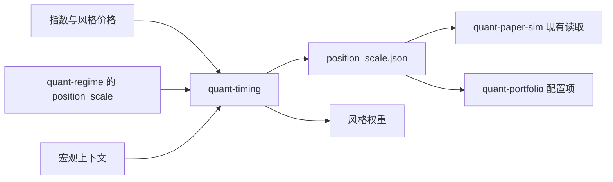

# quant-timing

指数与风格组合的研究层。它做两件事：

- 仓位择时：用已经走完的波动和窗口收益决定股票预算，其余放在现金。
- 风格择时：在大小盘、价值成长这两对风格之间做多头倾斜。

交易对象是指数和风格袖套，不是个股。规则写在配置里，验证段不搜索参数。样本外对照没有通过时，不会写出可供下游读取的 `position_scale.json`。

这不是价格预测，也不会下单。订单文件里的状态固定为 `target`。

## 时点

决策日收盘可以使用当天及更早的价格。这个权重赚的是下一根 K 线的收益，调仓成本也记在下一根 K 线上。信号不足时仓位是现金，不会外推成满仓。

完整约定和一笔三天的数字例子见 [研究契约](docs/RESEARCH_CONTRACT.md)。

## 运行

```powershell
python -m pip install -e ".[dev]"
python -m quant_timing.synthetic
python -m quant_timing run --config configs/combined.yaml --out outputs/demo
python -m pytest -q
python -m ruff check src tests
```

`configs/position_only.yaml` 只做仓位择时，股票预算全部留在市场袖套。

## 输出

| 文件 | 用途 |
| --- | --- |
| `position_scale.json` | 最新总仓位。只有审计通过、并且至少有一折打出了收益时才写出。`quant-paper-sim` 现有读取逻辑只使用其中的 `position_scale`。 |
| `portfolio_overlay.yaml` | 把同一个系数抄到已有的 `quant-portfolio` 策略条目上。 |
| `style_weights.csv` | 每期的风格权重和现金。 |
| `position_history.csv` | 模型仓位、封顶后的仓位和特征。 |
| `decision.json` | 含 `use`、`hold_previous` 或 `blocked` 的完整决定。 |
| `validation/` | 走步折、泄漏审计和摘要。全样本收益只作描述。 |
| `standard/` | 与研究运行契约一致的收益、持仓、目标订单、成本和暴露。 |



下游接入时不改它们的接口。模拟配置继续指向一个含 `position_scale` 的 JSON。组合配置继续在策略条目上填写 `position_scale`。

外部 regime 有两种读法，不能同时用：

- `regime.snapshot`：只封顶最新一次发布，不回放成历史。
- `regime.history`：按决策日之前最近一次发布的系数封顶整条回测。

宏观序列不完整时必须声明 `baseline` 或 `hold_previous`。上下文完整但没有显式规则时，不改变仓位。

## 边界

固定规则的对照结果不是收益承诺。仓库不修改 `quant-regime`、`quant-portfolio` 或 `quant-paper-sim`。
